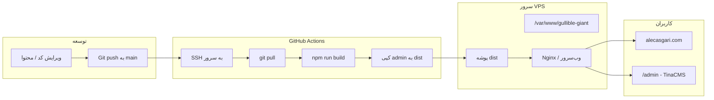
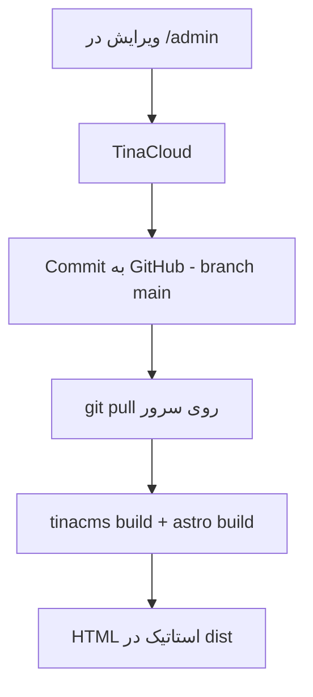
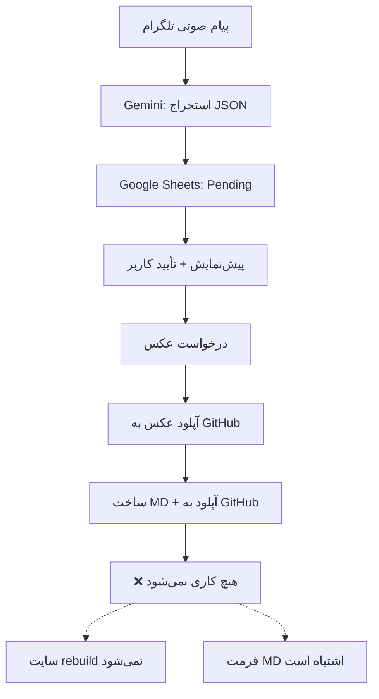
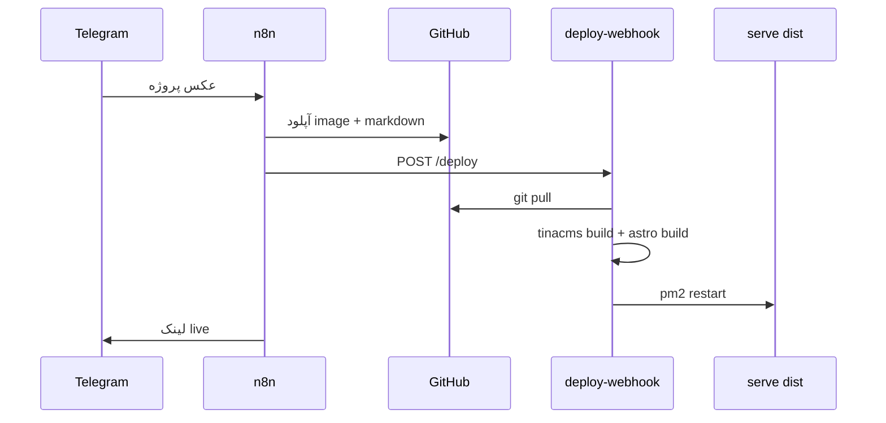

# نحوه دیپلوی پروژه
_Exported on 6/8/2026 at 15:41:15 GMT+4 from Cursor (3.1.14)_

---

**User**

یک توضیح جامع و کامل بده که این پروژه چطور دیپلوی میشود. همه جزئیات را بگو

---

**Cursor**

در حال بررسی ساختار پروژه و فایل‌های مرتبط با دیپلوی هستم.


# نحوه دیپلوی پروژه Gullible Giant

این پروژه یک **سایت استاتیک** است که با **Astro** ساخته می‌شود و محتوای آن با **TinaCMS** مدیریت می‌شود. دامنهٔ تولید: **https://alecasgari.com**. دیپلوی روی **سرور اختصاصی (VPS)** انجام می‌شود، نه روی Vercel/Netlify.

---

## معماری کلی



| لایه | تکنولوژی | نقش |
|------|----------|-----|
| فریم‌ورک | Astro 5 | تولید HTML استاتیک |
| CMS | TinaCMS + TinaCloud | ویرایش محتوا از `/admin` |
| محتوا | فایل‌های Markdown در `content/` | پست، پروژه، تیم، قیمت، نظرات |
| CI/CD | GitHub Actions | دیپلوی خودکار با push به `main` |
| جایگزین CI | `deploy-webhook.js` | دیپلوی با webhook (احتمالاً قدیمی‌تر یا موازی) |

---

## مسیر دیپلوی اصلی: GitHub Actions

فایل workflow:

```1:22:.github/workflows/deploy.yml
name: Deploy to Server

on:
  push:
    branches: [ main ]

jobs:
  deploy:
    runs-on: ubuntu-latest
    
    steps:
    - name: Deploy to server
      uses: appleboy/ssh-action@v0.1.5
      with:
        host: ${{ secrets.HOST }}
        username: ${{ secrets.USERNAME }}
        key: ${{ secrets.SSH_KEY }}
        script: |
          cd /var/www/gullible-giant
          git pull origin main
          npm run build
          cp -r public/admin dist/
```

### گام‌به‌گام

1. **تریگر:** هر `push` به شاخهٔ `main` workflow را اجرا می‌کند.
2. **اتصال SSH:** GitHub Actions با action `appleboy/ssh-action` به سرور وصل می‌شود.
3. **Secrets لازم در GitHub:**
   - `HOST` — IP یا hostname سرور
   - `USERNAME` — کاربر SSH
   - `SSH_KEY` — کلید خصوصی SSH
4. **روی سرور:**
   - `cd /var/www/gullible-giant`
   - `git pull origin main` — آخرین کد
   - `npm run build` — بیلد Astro
   - `cp -r public/admin dist/` — کپی پنل Tina به خروجی نهایی

### نکته مهم دربارهٔ بیلد Tina

در workflow فعلی فقط `npm run build` اجرا می‌شود. اما:

- `postinstall` در `package.json` بعد از `npm install`، `tinacms build` را اجرا می‌کند.
- اگر `node_modules` از قبل نصب باشد و فقط `git pull` + `build` بزنید، ممکن است پنل admin به‌روز نشود مگر `tinacms build` جداگانه اجرا شود.

اسکریپت webhook این مرحله را صریحاً انجام می‌دهد (بخش بعدی).

---

## مسیر جایگزین: Webhook دیپلوی

فایل `deploy-webhook.js` یک سرور Express است که دیپلوی را از طریق HTTP انجام می‌دهد.

### Endpointها

| متد | مسیر | کار |
|-----|------|-----|
| `POST` | `/deploy` | شروع دیپلوی |
| `GET` | `/health` | بررسی سلامت سرویس |

### احراز هویت

1. **GitHub Webhook (HMAC):** هدر `x-hub-signature-256` با `WEBHOOK_SECRET`
2. **دستی:** هدر `x-webhook-secret` با همان secret

### دستورات اجراشده روی سرور

```javascript
cd ${REPO_DIR}
git config --global --add safe.directory ${REPO_DIR}
git pull origin main
NEXT_PUBLIC_TINA_CLIENT_ID=... TINA_TOKEN=... npx -y tinacms build
npm run build
```

### متغیرهای محیطی

| متغیر | پیش‌فرض | توضیح |
|-------|---------|-------|
| `PORT` | `3000` | پورت webhook |
| `WEBHOOK_SECRET` | — | secret احراز هویت |
| `REPO_DIR` | `/home/alecadmin/alec-website` | مسیر repo روی سرور |
| `NEXT_PUBLIC_TINA_CLIENT_ID` | — | Client ID از TinaCloud |
| `TINA_TOKEN` | — | Token از TinaCloud |

**توجه:** مسیر پیش‌فرض webhook (`/home/alecadmin/alec-website`) با مسیر GitHub Actions (`/var/www/gullible-giant`) فرق دارد — احتمالاً دو setup یا migration است.

فایل `.env-webhook` در `.gitignore` است و برای envهای webhook استفاده می‌شود.

---

## فرآیند بیلد (Build Pipeline)

### 1. نصب وابستگی‌ها

```bash
npm install
```

`postinstall` به‌صورت خودکار Tina admin را می‌سازد:

```json
"postinstall": "node ./node_modules/@tinacms/cli/dist/index.js build"
```

### 2. بیلد TinaCMS

```bash
npx tinacms build
```

- خروجی admin: `public/admin/`
- client تولیدشده: `.tina/__generated__/` یا `tina/__generated__/` (در git نیست)
- نیاز به `NEXT_PUBLIC_TINA_CLIENT_ID` و `TINA_TOKEN`

### 3. بیلد Astro

```bash
npm run build
```

- خروجی: پوشهٔ `dist/`
- `site` در config: `https://alecasgari.com`
- sitemap و React هم فعال‌اند

### 4. کپی admin (فقط در دیپلوی GitHub Actions)

```bash
cp -r public/admin dist/
```

تا `/admin` روی سایت در دسترس باشد.

---

## TinaCMS و محتوا

### تنظیمات (`tina/config.ts`)

- شاخه: `main` (از envهای Git یا پیش‌فرض)
- `clientId` و `token` از env
- admin در `public/admin`
- collections: posts, projects, testimonials, team, pricing

### جریان محتوا



صفحاتی مثل blog و projects از `tina-client` در **زمان بیلد** محتوا را می‌خوانند — یعنی برای دیدن تغییرات محتوا باید دوباره بیلد و دیپلوی شود.

---

## زیرساخت سرور (استنتاج از repo)

در repo فایل Nginx/systemd نیست، اما از workflow مشخص است:

| مورد | مقدار |
|------|-------|
| مسیر پروژه | `/var/www/gullible-giant` |
| خروجی سرو | `dist/` |
| دامنه | `alecasgari.com` |
| پنل CMS | `alecasgari.com/admin` |

وب‌سرور (احتمالاً Nginx) باید `root` را روی `dist/` بگذارد و برای SPA/admin مسیر `/admin` را درست handle کند.

---

## متغیرهای محیطی لازم

### روی سرور (بیلد)

```env
NEXT_PUBLIC_TINA_CLIENT_ID=your_client_id
TINA_TOKEN=your_token
```

### در GitHub (Secrets)

```env
HOST=...
USERNAME=...
SSH_KEY=...
```

### برای webhook (اختیاری)

```env
WEBHOOK_SECRET=...
REPO_DIR=/var/www/gullible-giant
PORT=3000
```

---

## دیپلوی دستی (در صورت نیاز)

```bash
ssh user@your-server
cd /var/www/gullible-giant
git pull origin main
export NEXT_PUBLIC_TINA_CLIENT_ID="..."
export TINA_TOKEN="..."
npx tinacms build
npm run build
cp -r public/admin dist/
# در صورت نیاز: reload nginx
```

---

## توسعهٔ محلی

```bash
git clone https://github.com/alecasgari/gullible-giant.git
cd gullible-giant
npm install
cp .env.example .env   # README اشاره دارد؛ فایل در repo فعلی نیست
# پر کردن Tina credentials
npm run dev
```

---

## نکات و محدودیت‌ها

1. **فقط `main` دیپلوی می‌شود** — push به branchهای دیگر دیپلوی خودکار ندارد.
2. **سایت کاملاً استاتیک است** — بعد از بیلد، سرور فقط فایل‌های HTML/CSS/JS سرو می‌کند.
3. **تغییر محتوا = بیلد مجدد** — ویرایش در Tina تا زمان دیپلوی بعدی روی سایت live دیده نمی‌شود.
4. **`public/` در gitignore است** — assetها و admin روی سرور یا بعد از بیلد تولید می‌شوند.
5. **`express` در `package.json` نیست** — برای webhook باید جدا نصب شود یا در setup سرور باشد.
6. **دو مکانیزم دیپلوی** — GitHub Actions (فعلی) و webhook (قدیمی‌تر/جایگزین) با مسیرهای متفاوت.

---

## خلاصهٔ یک خطی

**Push به `main` → GitHub Actions با SSH به سرور → `git pull` → `npm run build` → کپی `public/admin` به `dist/` → Nginx فایل‌های `dist/` را روی `alecasgari.com` سرو می‌کند.**

اگر بخواهید، می‌توانم workflow را طوری پیشنهاد بدهم که `tinacms build` هم همیشه قبل از `astro build` اجرا شود، یا یک چک‌لیست setup اولیهٔ سرور (Nginx + Node + PM2 برای webhook) بنویسم.

---

**User**

@c:\Users\aleca\.cursor\projects\c-Users-aleca-OneDrive-Documents-12-CodeWithAlec-01-Website-gullible-giant\terminals\1.txt این سرور من هست الان سایت بالا نمیاد چه کنیم؟

---

**Cursor**

در حال بررسی وضعیت ترمینال SSH و سرویس‌های سرور هستم.


**تشخیص:** سایت کاملاً down نیست؛ مشکل اصلی این است که **صفحهٔ اصلی (`/`) فایل `index.html` ندارد** و به‌جای سایت، یک **لیست فایل‌ها** نشان می‌دهد (مثل `serve` npm). بعضی صفحات مثل `/about/` و `/blog/` کار می‌کنند، ولی `/contact/` و `/projects/` **404** می‌دهند.

یعنی پوشهٔ `dist/` روی سرور **ناقص یا خراب** است — احتمالاً بیلد نصفه مانده یا envهای TinaCMS درست نبوده.

---

## الان در SSH این دستورات را بزنید

### ۱. تشخیص سریع

```bash
cd /var/www/gullible-giant

# آیا index.html هست؟
ls -la dist/index.html

# محتوای dist
ls -la dist/

# nginx
sudo systemctl status nginx --no-pager

# چه پروسسی سایت را سرو می‌کند؟
sudo ss -tlnp | grep -E ':80|:443'
pm2 list 2>/dev/null
```

اگر `dist/index.html` وجود نداشت، همان علت مشکل است.

---

### ۲. بیلد تمیز و دیپلوی مجدد

```bash
cd /var/www/gullible-giant

# آخرین کد
git pull origin main

# envهای Tina — اگر فایل .env دارید:
set -a && source .env && set +a

# یا دستی:
# export NEXT_PUBLIC_TINA_CLIENT_ID="..."
# export TINA_TOKEN="..."

# پاک کردن بیلد قبلی
rm -rf dist

# بیلد Tina + Astro
npx tinacms build
npm run build

# کپی پنل admin
cp -r public/admin dist/

# بررسی
ls -la dist/index.html
```

اگر `npm run build` خطا داد، **کل خروجی خطا** را بفرستید — معمولاً به‌خاطر نبودن `TINA_TOKEN` یا `NEXT_PUBLIC_TINA_CLIENT_ID` است.

---

### ۳. ری‌استارت سرویس

بسته به setup سرور:

```bash
# اگر nginx مستقیم dist را سرو می‌کند:
sudo nginx -t && sudo systemctl reload nginx

# اگر pm2 دارید:
pm2 list
pm2 restart all   # یا نام پروسس مربوط به سایت
```

---

### ۴. تست

```bash
curl -I http://127.0.0.1/
curl -I http://127.0.0.1/contact/
```

باید `HTTP/1.1 200` ببینید، نه لیست فایل.

---

## اگر مسیر پروژه فرق دارد

اگر `/var/www/gullible-giant` نبود:

```bash
find /var/www /home/alecadmin -maxdepth 3 -name "gullible-giant" -type d 2>/dev/null
```

---

## خلاصهٔ مشکل

| وضعیت | علت |
|--------|-----|
| `/` لیست فایل نشان می‌دهد | `dist/index.html` وجود ندارد |
| بعضی صفحات 404 | بیلد ناقص |
| فایل‌های `.mjs` در dist | بیلد قدیمی/اشتباه (SSR) مخلوط شده |

---

خروجی این دو دستور را اینجا paste کنید تا دقیق‌تر بگوییم چه کار کنید:

```bash
cd /var/www/gullible-giant && ls -la dist/index.html && ls dist/ | head -20
npm run build
```

---

**User**

@c:\Users\aleca\.cursor\projects\c-Users-aleca-OneDrive-Documents-12-CodeWithAlec-01-Website-gullible-giant\terminals\1.txtچک کن لطفا

---

**Cursor**

بررسی خروجی ترمینال — چند نکتهٔ مهم:

## یافته‌ها

### ۱. مسیر اشتباه در GitHub Actions
مسیر `/var/www/gullible-giant` روی سرور **وجود ندارد**. workflow فعلی به مسیر اشتباه deploy می‌کند و احتمالاً هرگز درست کار نکرده.

### ۲. Nginx خاموش است
```
Active: inactive (dead)
```
سایت از nginx سرو **نمی‌شود**.

### ۳. سایت از Docker + PM2 اجرا می‌شود
- پورت‌های 80 و 443 → `docker-proxy` (Docker)
- PM2: پروسس **`alec-website`** در حال اجراست

پروژهٔ واقعی احتمالاً در `/home/alecadmin/alec-website` است (همان مسیری که در `deploy-webhook.js` آمده).

---

## دستورات بعدی — در SSH بزنید

```bash
# پیدا کردن مسیر واقعی پروژه
pm2 show alec-website

# یا
find /home/alecadmin -maxdepth 3 -name "package.json" 2>/dev/null | grep -i gullible
find /home/alecadmin -maxdepth 3 -type d -name "*website*" 2>/dev/null
ls -la /home/alecadmin/
```

بعد از پیدا کردن مسیر (مثلاً `/home/alecadmin/alec-website`):

```bash
cd /home/alecadmin/alec-website   # مسیر واقعی را جایگزین کنید

ls -la dist/index.html
ls dist/ | head -20

# envهای Tina
cat .env 2>/dev/null || echo "no .env file"

# بیلد تمیز
rm -rf dist
npx tinacms build
npm run build
cp -r public/admin dist/

# بررسی
ls -la dist/index.html

# ری‌استارت
pm2 restart alec-website
pm2 logs alec-website --lines 30
```

برای دیدن Docker:

```bash
docker ps
docker ps --format "table {{.Names}}\t{{.Ports}}\t{{.Status}}"
```

---

## خلاصه

| مورد | وضعیت |
|------|--------|
| مسیر در `deploy.yml` | اشتباه — `/var/www/gullible-giant` وجود ندارد |
| سرویس واقعی | PM2 (`alec-website`) + Docker reverse proxy |
| Nginx | خاموش |
| علت سایت | `dist` ناقص یا `index.html` ندارد |

خروجی `pm2 show alec-website` و `ls -la dist/` را paste کنید تا دقیق بگوییم چه کار کنید. اگر بخواهید، `deploy.yml` را هم با مسیر درست اصلاح می‌کنم.

---

**User**

@c:\Users\aleca\.cursor\projects\c-Users-aleca-OneDrive-Documents-12-CodeWithAlec-01-Website-gullible-giant\terminals\1.txt چک کن لطفا

---

**Cursor**

**تشخیص کامل شد.** خروجی ترمینال همه‌چیز را روشن کرد:

## وضعیت فعلی

| مورد | نتیجه |
|------|--------|
| مسیر واقعی پروژه | `/home/alecadmin/alec-website` |
| PM2 | `serve dist -l 4321` (پورت 4321) |
| Docker | پورت 80/443 را به این سرویس forward می‌کند |
| `dist/index.html` | **وجود ندارد** ← علت اصلی مشکل |
| `.env` | **وجود ندارد** ← TinaCMS credential ندارد |
| محتوای `dist/` | بیلد ناقص/اشتباه (فایل‌های `.mjs` و پوشه `pages/`) |

صفحهٔ اصلی به `index.html` نیاز دارد؛ چون نیست، `serve` لیست فایل‌ها نشان می‌دهد.

---

## الان این دستورات را بزنید

### ۱. ساخت فایل `.env` با credentialهای Tina

```bash
cd /home/alecadmin/alec-website
nano .env
```

محتوا (مقادیر واقعی از [tina.io](https://app.tina.io) را بگذارید):

```env
NEXT_PUBLIC_TINA_CLIENT_ID=your_client_id_here
TINA_TOKEN=your_token_here
```

ذخیره: `Ctrl+O` → Enter → `Ctrl+X`

---

### ۲. بیلد تمیز

```bash
cd /home/alecadmin/alec-website

set -a && source .env && set +a

rm -rf dist

npx tinacms build
npm run build
cp -r public/admin dist/

# باید فایل را ببینید:
ls -la dist/index.html
```

اگر `npm run build` خطا داد، **کل خروجی خطا** را paste کنید.

---

### ۳. ری‌استارت PM2

```bash
pm2 restart alec-website
pm2 logs alec-website --lines 20
```

---

### ۴. تست

```bash
curl -I http://127.0.0.1:4321/
```

باید `HTTP/1.1 200 OK` ببینید، نه لیست فایل.

---

## نکتهٔ مهم: GitHub Actions اشتباه deploy می‌کند

`deploy.yml` به `/var/www/gullible-giant` می‌رود که روی سرور وجود ندارد. دیپلوی خودکار کار نمی‌کند.

مسیر درست باید این باشد:

```yaml
cd /home/alecadmin/alec-website
```

اگر بخواهید، `deploy.yml` را اصلاح می‌کنم تا:
- مسیر درست باشد
- `tinacms build` اجرا شود
- قبل از بیلد `dist` پاک شود
- `pm2 restart alec-website` هم اضافه شود

---

Credentialهای Tina را دارید یا باید از TinaCloud بگیرید؟ بعد از `npm run build` خروجی را بفرستید.

---

**User**

توکن های تینا را ندارم. توی فایل های لوکال بگرد و پیدا کن حتما هست

---

**Cursor**

فایل‌های `.env` پیدا شدند؛ در حال خواندن محتوایشان هستم.


**پیدا شدند.** در فایل `.env` لوکال (gitignore شده، برای همین در جستجوی عادی دیده نمی‌شد):

## توکن‌های فعال (از `.env`)

```env
NEXT_PUBLIC_TINA_CLIENT_ID=4baaf4c9-4883-4d15-89fa-1d818abb0ef9
TINA_TOKEN=bf6a6e0460b5d7a999388ada87b0a4144ffec5a8
GITHUB_BRANCH=main
```

این همان credentialهایی است که بیلد لوکال با آن کار می‌کند (در `tina/__generated__/client.ts` هم همین Client ID دیده می‌شود).

---

## نکته: دو مجموعه credential دارید

| فایل | وضعیت |
|------|--------|
| `.env` | **فعال** — همین را استفاده کنید |
| `.env.local` | فقط `demo` — برای dev موقت |
| `.env-webhook` | Client ID متفاوت — احتمالاً قدیمی |

---

## روی سرور (SSH) این‌ها را بزنید

```bash
cd /home/alecadmin/alec-website

cat > .env << 'EOF'
NEXT_PUBLIC_TINA_CLIENT_ID=4baaf4c9-4883-4d15-89fa-1d818abb0ef9
TINA_TOKEN=bf6a6e0460b5d7a999388ada87b0a4144ffec5a8
GITHUB_BRANCH=main
EOF

set -a && source .env && set +a

rm -rf dist
npx tinacms build
npm run build
cp -r public/admin dist/

ls -la dist/index.html

pm2 restart alec-website
curl -I http://127.0.0.1:4321/
```

اگر `dist/index.html` ساخته شد و `curl` پاسخ `200` داد، سایت باید بالا بیاید.

---

**هشدار امنیتی:** این توکن‌ها secret هستند. آن‌ها را در چت عمومی یا git commit نگذارید. اگر جایی لو رفته، از [app.tina.io](https://app.tina.io) token جدید بسازید.

خروجی `npm run build` و `ls -la dist/index.html` را بفرستید تا مطمئن شویم درست شده.

---

**User**

عالی بود دمت گرم سایت بالا اومد. @c:\Users\aleca\.cursor\projects\c-Users-aleca-OneDrive-Documents-12-CodeWithAlec-01-Website-gullible-giant\terminals\1.txt چک کن ترمینال رو لطفا

---

**Cursor**

**همه‌چیز درست شده.** ترمینال و سایت live را چک کردم — خلاصه:

## وضعیت: موفق

| مرحله | نتیجه |
|--------|--------|
| ساخت `.env` | انجام شد |
| `npm run build` | موفق — **17 صفحه** ساخته شد |
| `dist/index.html` | وجود دارد (74KB) |
| `pm2 restart alec-website` | online |
| `curl localhost:4321` | **HTTP 200** |
| `https://alecasgari.com` | **HTTP 200** — عنوان: «Alec Asgari» |

سایت دیگر لیست فایل نشان نمی‌دهد و صفحهٔ اصلی واقعی لود می‌شود.

---

## یک هشدار کوچک (مهم نیست، ولی بدانید)

`npx tinacms build` **خطا داد**:

```
Tina Dev server is already in use. Datalayer server is busy on port 9000
```

یعنی پورت 9000 اشغال بود. با این حال `astro build` موفق شد چون client قبلی Tina هنوز موجود بود و env هم ست شده بود.

**برای دیپلوی‌های بعدی** اگر خواستید admin panel هم حتماً به‌روز شود:

```bash
# پیدا کردن پروسسی که پورت 9000 را گرفته
sudo lsof -i :9000
# یا
fuser -k 9000/tcp

# بعد دوباره
npx tinacms build
```

---

## پیشنهاد برای آینده

1. **`deploy.yml`** هنوز به `/var/www/gullible-giant` اشاره می‌کند — باید به `/home/alecadmin/alec-website` تغییر کند تا push به `main` خودکار deploy کند.
2. **`.env` روی سرور** الان هست — دیپلوی بعدی بدون آن هم کار می‌کند.
3. سرور پیام **`System restart required`** دارد — وقتی فرصت شد یک reboot برنامه‌ریزی کنید.

اگر بخواهید `deploy.yml` را الان درست کنم بگویید.

---

**User**

@c:\Users\aleca\Downloads\Alec Project Writer (1).json 
ببین من این ورکفلو را توی n8n زده ام. میخواهم که از این طریق مستقیما یک پروژه جدید در وبسایت قرار بگیرد. به نظرت باید چه کارهایی بکنیم که این درست بشه. یه نقشه راه ترسیم کن اول بعد بریم سراغش. سوالی داری بپرس

---

**Cursor**

ابتدا ورکفلو n8n و نحوهٔ افزودن پروژه‌ها در سایت را بررسی می‌کنم.


# نقشه راه: انتشار خودکار پروژه از n8n به وبسایت

ورکفلو را بررسی کردم. **تا ۸۰٪ راه را رفته‌اید** — از صدا تا Google Sheet و آپلود GitHub. مشکل اصلی این است که خروجی n8n با فرمت واقعی سایت (TinaCMS + Astro) **هم‌خوان نیست** و بعد از commit هم **دیپلوی خودکار** ندارید.

---

## وضعیت فعلی ورکفلو



---

## مشکلات اصلی (چرا الان روی سایت نمی‌آید)

### ۱. فرمت frontmatter اشتباه است

n8n الان این را می‌سازد:

```yaml
title, date, category, tags, client, duration, image
```

ولی TinaCMS و سایت این فیلدها را می‌خواهند:

| n8n (فعلی) | سایت (لازم) |
|------------|-------------|
| `date` | `projectDate` (ISO مثل `2026-06-08T00:00:00.000Z`) |
| `image` | `featuredImage` |
| `client` | `clientName` + `clientCompany` |
| — | `excerpt` (الزامی) |
| — | `projectLink` (الزامی) |
| — | `status` (الزامی: Completed / In Progress / ...) |
| body خام | `description` به‌عنوان body |
| `technologies_used` در شیت | `technologies` (آرایه در frontmatter) |

### ۲. نام فایل اشتباه است

- n8n: `content/projects/5558318.md`
- سایت: `AI-Powered-Chatbot.md` (slug از عنوان)
- URL نهایی: `/projects/AI-Powered-Chatbot/`

### ۳. بعد از GitHub هیچ deployی نیست

commit به GitHub انجام می‌شود، ولی:
- `deploy.yml` مسیر اشتباه دارد (`/var/www/gullible-giant`)
- سرور واقعی: `/home/alecadmin/alec-website` + PM2
- پس سایت rebuild نمی‌شود

### ۴. نودهای انتهایی ناقص‌اند

بعد از `Upload MD` هیچ اتصالی نیست:
- آپدیت `publish_status` → `Published`
- ذخیره `project_link`
- پیام تلگرام «پروژه live شد»
- تریگر deploy

### ۵. پوشه `public/` در `.gitignore` است

عکس به `public/Projects/{id}.jpg` می‌رود. از API گیت‌هاب کار می‌کند، ولی باید مطمئن شویم بعد از `git pull` روی سرور عکس هم می‌آید.

---

## نقشه راه پیشنهادی (۵ فاز)

### فاز ۱ — اصلاح قالب Markdown در n8n
**هدف:** فایلی بسازید که Tina/Astro بدون خطا بخوانند.

در نود `Prepare MD for GitHub`:
- slug از `project_title` بسازید (مثل `Automated-Webinar-Registration`)
- frontmatter را مطابق schema Tina بنویسید
- `projectLink` پیش‌فرض: `https://alecasgari.com/projects/{slug}/`
- `status: Completed` (یا از AI بپرسید)
- `featured: false` (مگر بخواهید برعکس باشد)

**خروجی نمونه:**

```yaml
---
title: "Automated Webinar Registration..."
excerpt: "A comprehensive end-to-end automation..."
featuredImage: /Projects/automated-webinar-registration.jpg
projectLink: 'https://alecasgari.com/projects/Automated-Webinar-Registration/'
category: AI Automation
tags:
  - Webinar Automation
  - n8n
projectDate: 2026-06-08T00:00:00.000Z
clientName: Confidential Client
clientCompany: Confidential Client
technologies:
  - n8n
  - Telegram Bot API
duration: 4 weeks
status: Completed
featured: false
---

## Project Overview
...
```

---

### فاز ۲ — اصلاح مسیر فایل‌ها در GitHub
**هدف:** نام فایل و عکس هماهنگ با slug.

| فایل | مسیر جدید |
|------|-----------|
| Markdown | `content/projects/{slug}.md` |
| تصویر | `public/Projects/{slug}.jpg` |

نودهای `Upload image` و `Upload MD` را با slug (نه `project_id`) آپدیت کنید.

---

### فاز ۳ — راه‌اندازی Deploy خودکار
**هدف:** بعد از push، سایت rebuild شود.

**گزینه A (پیشنهادی):** اصلاح `deploy.yml` در GitHub Actions:

```yaml
cd /home/alecadmin/alec-website
git pull origin main
set -a && source .env && set +a
npx tinacms build || true
npm run build
cp -r public/admin dist/
pm2 restart alec-website
```

**گزینه B:** n8n بعد از upload، به `deploy-webhook.js` روی سرور POST بزند.

**گزینه C:** هر دو (Actions + webhook به‌عنوان fallback)

---

### فاز ۴ — تکمیل انتهای ورکفلو n8n
**هدف:** بستن چرخه publish.

بعد از `Upload MD` اضافه کنید:

1. **Google Sheets Update** — `publish_status: Published`, `project_link`, `image_link`, `updated_at`
2. **Telegram** — «پروژه منتشر شد: https://alecasgari.com/projects/{slug}/»
3. **HTTP Request** (اختیاری) — تریگر deploy اگر Actions تأخیر دارد

---

### فاز ۵ — تست و اعتبارسنجی
**چک‌لیست:**

- [ ] فایل MD در GitHub با frontmatter درست
- [ ] عکس در `public/Projects/` موجود
- [ ] `git pull` روی سرور فایل‌ها را می‌آورد
- [ ] `npm run build` بدون خطا
- [ ] صفحه در `/projects/{slug}/` باز می‌شود
- [ ] در صفحه اصلی (اگر `featured: true`) نمایش داده می‌شود
- [ ] Tina `/admin` پروژه را نشان می‌دهد

---

## ترتیب پیشنهادی اجرا

```
۱. اصلاح Prepare MD + نام فایل‌ها     ← سریع، فقط n8n
۲. تست دستی: یک پروژه commit کنید    ← ببینید MD درست است
۳. اصلاح deploy.yml روی سرور          ← سایت auto-update
۴. نودهای انتهایی n8n                ← اعلان + sheet
۵. تست end-to-end از تلگرام           ← یک voice تا live
```

---

## سوالاتی که قبل از شروع باید جواب بدهید

1. **انتشار:** بلافاصله بعد از عکس live شود، یا یک مرحله تأیید نهایی در Tina/admin هم بخواهید؟

2. **`projectLink`:** همیشه لینک صفحه پروژه روی سایت خودتان باشد، یا گاهی لینک خارجی (مثلاً GitHub demo)؟

3. **`featured`:** پروژه‌های جدید به‌صورت پیش‌فرض در صفحه اصلی نمایش داده شوند؟

4. **YouTube:** شاخه YouTube در ورکفلو (فعلاً disabled) را هم می‌خواهید به `videoUrl` وصل کنیم؟

5. **Deploy:** GitHub Actions کافی است، یا حتماً webhook از n8n به سرور هم بزنیم؟

6. **`public/` در gitignore:** می‌خواهید عکس‌ها در repo بمانند (با force-add از GitHub API) یا عکس را مستقیم روی سرور آپلود کنیم؟

---

## جمع‌بندی

| بخش | وضعیت |
|-----|--------|
| Telegram → AI → Sheet | آماده |
| تأیید + دریافت عکس | آماده |
| آپلود GitHub | نیمه‌آماده (فرمت اشتباه) |
| Deploy سایت | ندارد |
| اعلان نهایی | ندارد |

**کار اصلی:** اصلاح قالب MD + slug + deploy خودکار. بقیه بیشتر wiring است.

جواب سوالات بالا را بدهید تا فاز ۱ را دقیق (با کد نود `Prepare MD for GitHub`) شروع کنیم.

---

**User**

1.	انتشار: بلافاصله بعد از عکس live شود، یا یک مرحله تأیید نهایی در Tina/admin هم بخواهید؟  بلافاصله آپلود شود عکس
2.	projectLink: همیشه لینک صفحه پروژه روی سایت خودتان باشد، یا گاهی لینک خارجی (مثلاً GitHub demo)؟ همیشه لینک اصلی پروژه در سایت باشد
3.	featured: پروژه‌های جدید به‌صورت پیش‌فرض در صفحه اصلی نمایش داده شوند؟ همه پست ها feature باشند
4.	YouTube: شاخه YouTube در ورکفلو (فعلاً disabled) را هم می‌خواهید به videoUrl وصل کنیم؟ نه یوتیوب برای فازهای بعدی
5.	Deploy: GitHub Actions کافی است، یا حتماً webhook از n8n به سرور هم بزنیم؟ به نظرت کدام بهتر است؟ من إحساس میکنم از n8n به سرور بزنیم راحت تر باشد نه؟
6.	public/ در gitignore: می‌خواهید عکس‌ها در repo بمانند (با force-add از GitHub API) یا عکس را مستقیم روی سرور آپلود کنیم؟ هر کدام که راحت تر و بی دردسر تر است


---

**Cursor**

# تصمیم‌ها ثبت شد — طرح نهایی

با جواب‌های شما، مسیر مشخص است. برای دو سوال باز هم توصیهٔ مستقیم می‌دهم.

---

## Deploy: n8n → سرور یا GitHub Actions؟

**پیشنهاد: n8n → webhook سرور (روش اصلی)**

| | n8n → سرور | GitHub Actions |
|--|------------|----------------|
| زمان‌بندی | دقیقاً بعد از آپلود MD + عکس | بعد از هر push به `main` |
| کنترل | شما می‌دانید deploy کی اجرا می‌شود | حتی pushهای غیرمرتبط هم deploy می‌زنند |
| پیچیدگی | webhook روی سرور + یک HTTP Request در n8n | Secrets SSH + مسیر درست + `.env` روی runner |
| خطا | اگر commit شد ولی deploy نشد، n8n می‌تواند retry بزند | جدا از n8n است |

**احساس شما درست است** — برای این use case (انتشار از تلگرام) راحت‌تر است.

در پروژه همین الان `deploy-webhook.js` دارید. کافی است:
1. روی سرور با PM2 اجرا شود
2. n8n بعد از `Upload MD` به `POST /deploy` بزند
3. Docker/npm proxy پورت webhook را expose کند (یا فقط از localhost + SSH)

**GitHub Actions** را به‌عنوان **پشتیبان** نگه دارید (اختیاری) — اگر webhook fail شد، push به `main` باز هم deploy کند. ولی لازم نیست هر دو را همزمان فعال کنید؛ اول webhook را درست کنید.



---

## عکس‌ها: GitHub یا مستقیم سرور؟

**پیشنهاد: همان مسیر فعلی — آپلود به GitHub**

- n8n از قبل `Upload image` به GitHub دارد
- `.gitignore` لوکال مانع commit از API نمی‌شود
- با `git pull` روی سرور عکس و MD با هم می‌آیند
- یک منبع حقیقت (repo) — ساده‌تر از SCP جداگانه

فقط نام فایل را از `5558318.jpg` به `{slug}.jpg` تغییر دهید.

---

## قوانین محتوا (طبق جواب شما)

| فیلد | مقدار |
|------|--------|
| انتشار | بلافاصله بعد از عکس |
| `projectLink` | `https://alecasgari.com/projects/{slug}/` |
| `featured` | همیشه `true` |
| `status` | `Completed` (پیش‌فرض) |
| `videoUrl` | خالی (فاز بعد) |
| YouTube branch | فعلاً نادیده |

---

## فازهای اجرا (به ترتیب)

### فاز ۱ — اصلاح n8n (بدون لمس سرور)
1. نود `Prepare MD for GitHub` — frontmatter مطابق Tina
2. تابع slug از `project_title`
3. مسیرها: `content/projects/{slug}.md` و `public/Projects/{slug}.jpg`
4. بعد از `Upload MD`:
   - آپدیت Sheet → `Published` + `project_link`
   - پیام تلگرام با لینک live

### فاز ۲ — webhook روی سرور
1. `deploy-webhook.js` با PM2 (`alec-deploy-webhook`)
2. `REPO_DIR=/home/alecadmin/alec-website`
3. اسکریپت deploy: `git pull` → `source .env` → `tinacms build` → `npm run build` → `cp admin` → `pm2 restart alec-website`
4. expose از طریق Docker/npm (مثلاً `deploy.alecasgari.com` یا مسیر داخلی)

### فاز ۳ — اتصال n8n به webhook
1. نود **HTTP Request** بعد از `Upload MD`
2. Header: `x-webhook-secret`
3. On error → retry یا پیام خطا در تلگرام

### فاز ۴ — تست end-to-end
1. یک voice تست → عکس → چک GitHub → چک سایت live

### فاز ۵ (اختیاری) — GitHub Actions به‌عنوان backup
- اصلاح مسیر به `/home/alecadmin/alec-website`

---

## کد پیشنهادی برای `Prepare MD for GitHub`

این را در نود Code جایگزین کنید:

```javascript
const projectData = $('Get Project for photo').first().json;

function slugify(title) {
  return title
    .trim()
    .replace(/[^\w\s-]/g, '')
    .replace(/\s+/g, '-')
    .replace(/-+/g, '-')
    .slice(0, 80);
}

const slug = slugify(projectData.project_title);
const imagePath = `/Projects/${slug}.jpg`;
const projectLink = `https://alecasgari.com/projects/${slug}/`;

const tags = projectData.tags
  .split(',')
  .map(t => t.trim())
  .filter(Boolean);

const technologies = projectData.technologies_used
  .split(',')
  .map(t => t.trim())
  .filter(Boolean);

const projectDate = projectData.project_date.includes('T')
  ? projectData.project_date
  : `${projectData.project_date}T00:00:00.000Z`;

const markdownContent = `---
title: >-
  ${projectData.project_title}
excerpt: >-
  ${projectData.short_description}
featuredImage: ${imagePath}
projectLink: '${projectLink}'
category: ${projectData.category}
tags:
${tags.map(t => `  - ${t}`).join('\n')}
projectDate: ${projectDate}
clientName: ${projectData.client_name}
clientCompany: ${projectData.client_company}
technologies:
${technologies.map(t => `  - ${t}`).join('\n')}
duration: ${projectData.project_duration}
status: Completed
featured: true
---

${projectData.project_description}
`;

return {
  slug,
  project_id: projectData.project_id,
  project_link: projectLink,
  image_path: imagePath,
  base64_markdown: Buffer.from(markdownContent).toString('base64'),
};
```

و در نودهای GitHub:
- `filePath` عکس: `public/Projects/{{ $json.slug }}.jpg`
- `filePath` MD: `content/projects/{{ $json.slug }}.md`

---

## سوال آخر قبل از شروع پیاده‌سازی

**webhook deploy از کجا صدا زده شود؟**

- **A)** `https://n8n.alecasgari.com/...` → n8n مستقیم به سرور (نیاز به URL عمومی برای webhook)
- **B)** n8n از داخل همان سرور به `http://127.0.0.1:3000/deploy` بزند (اگر n8n و سایت روی یک VPS هستند — **ساده‌تر و امن‌تر**)

اگر n8n روی همان سرور Contabo است، گزینه **B** بهترین است.

بگویید از کدام شروع کنیم:
1. اصلاح `deploy-webhook.js` + راه‌اندازی PM2 روی سرور
2. فقط دستورالعمل n8n برای شما
3. هر دو با هم

---

**User**

من طبق گفته تو n8n را اصلاح کردم. هم کد و هم فایل پث برای دو ماژول گیت هاب. 
now we can switch to english from now on. 
for this question "webhook deploy از کجا صدا زده شود؟" I choose B option. 

Lets proceed

---

**Cursor**

Implementing the deploy webhook for Option B: updating `deploy-webhook.js`, adding dependencies, and preparing server setup.


Code changes are in the repo. Here is what was done and what you need to run on the server.

## What changed in the repo

| File | Purpose |
|------|---------|
| `scripts/deploy-server.sh` | Full deploy: `git pull` → Tina build → Astro build → copy admin → `pm2 restart` |
| `deploy-webhook.js` | Listens on `127.0.0.1:3000`, calls the script, blocks concurrent deploys |
| `.env-webhook.example` | Template for server webhook config |
| `package.json` | Added `express`, `npm run webhook`, `npm run deploy:server` |
| `.github/workflows/deploy.yml` | Backup: SSH + `curl` to local webhook (needs `WEBHOOK_SECRET` in GitHub secrets) |

---

## Step 1 — Push from your machine

Commit and push these changes to `main` so the server can pull them.

---

## Step 2 — Server setup (run in SSH)

```bash
cd /home/alecadmin/alec-website
git pull origin main
npm install
chmod +x scripts/deploy-server.sh

# Webhook config (pick a strong secret)
cat > .env-webhook << 'EOF'
HOST=127.0.0.1
PORT=3000
WEBHOOK_SECRET=PICK_A_LONG_RANDOM_SECRET_HERE
REPO_DIR=/home/alecadmin/alec-website
PM2_APP=alec-website
EOF

# Start webhook with PM2
set -a && source .env-webhook && set +a
pm2 start npm --name alec-deploy-webhook -- run webhook
pm2 save
```

---

## Step 3 — Test the webhook

```bash
# Health check
curl http://127.0.0.1:3000/health

# Deploy test (replace YOUR_SECRET)
curl -X POST http://127.0.0.1:3000/deploy \
  -H "x-webhook-secret: YOUR_SECRET" \
  -H "Content-Type: application/json" \
  -d '{}'
```

You should get `{"success":true,...}` and the site should rebuild.

---

## Step 4 — Add n8n node (after `Upload MD`)

Add an **HTTP Request** node:

| Setting | Value |
|---------|--------|
| Method | `POST` |
| URL | `http://127.0.0.1:3000/deploy` |
| Headers | `x-webhook-secret` = same value as in `.env-webhook` |
| Body | `{}` (JSON) |
| On error | Continue or send Telegram error message |

Then chain:
1. **Google Sheets** — update `publish_status` → `Published`, `project_link` → `{{ $('Prepare MD for GitHub').item.json.project_link }}`
2. **Telegram** — `Project live: {{ $json.project_link }}`

---

## Security note (Option B)

The webhook binds to `127.0.0.1` only, so it is not reachable from the internet — only n8n on the same server can call it.

---

## Optional — GitHub Actions backup

Add a GitHub secret:

- Name: `WEBHOOK_SECRET`
- Value: same secret as `.env-webhook` on the server

Then any push to `main` will also trigger deploy via SSH + local curl.

---

Push the code first, then run the server commands. Paste the output of the test `curl` if anything fails and we will fix it.

---

**User**

@c:\Users\aleca\.cursor\projects\c-Users-aleca-OneDrive-Documents-12-CodeWithAlec-01-Website-gullible-giant\terminals\1.txt Check please

---

**Cursor**

Here is what the terminals show:

## Terminal 1 (SSH server) — older session, site is OK

This is from the **earlier manual fix**, not the webhook setup. The important part:

| Step | Result |
|------|--------|
| `.env` created | OK |
| `npm run build` | OK — 17 pages, including `index.html` |
| `dist/index.html` | Exists (74KB) |
| `pm2 restart alec-website` | online |
| `curl http://127.0.0.1:4321/` | **HTTP 200** |

`tinacms build` failed (port 9000 busy), but Astro build still succeeded.

**Not done yet on the server:**
- `git pull` for the new webhook code
- `.env-webhook` creation
- `pm2 start` for `alec-deploy-webhook`
- webhook test with `curl`

---

## Terminal 3 (local) — push blocked

Your commit `Start` was created locally, but **push failed**:

```
! [rejected] main -> main (fetch first)
```

GitHub has commits you don’t have locally — almost certainly from **n8n uploading projects** to the repo.

---

## What to do next

### 1. On your PC — sync and push

```powershell
cd "C:\Users\aleca\OneDrive\Documents\12 - CodeWithAlec\01 - Website\gullible-giant"
git pull origin main
# resolve conflicts if any, then:
git push origin main
```

### 2. On the server (SSH) — deploy webhook

```bash
cd /home/alecadmin/alec-website
git pull origin main
npm install
chmod +x scripts/deploy-server.sh

cat > .env-webhook << 'EOF'
HOST=127.0.0.1
PORT=3000
WEBHOOK_SECRET=your-long-random-secret
REPO_DIR=/home/alecadmin/alec-website
PM2_APP=alec-website
EOF

set -a && source .env-webhook && set +a
pm2 start npm --name alec-deploy-webhook -- run webhook
pm2 save
pm2 list

curl http://127.0.0.1:3000/health
curl -X POST http://127.0.0.1:3000/deploy \
  -H "x-webhook-secret: your-long-random-secret" \
  -H "Content-Type: application/json" \
  -d '{}'
```

---

## Summary

- **Site:** running fine from the manual build.
- **Webhook code:** committed locally but **not on GitHub** yet (push rejected).
- **Server:** still on old code — webhook not installed.

Fix the `git pull` + `git push` on your PC first, then run the server commands above. Paste the output if anything fails.

---

**User**

I face error please run local command by your end.

---

**Cursor**

Merge conflict in `deploy.yml`. Resolving it and pushing.


**Fixed.** Here is what happened and what was done:

## The problem
1. `git push` failed — GitHub had **18 new commits** from n8n (project uploads).
2. `git pull` caused a **merge conflict** in `.github/workflows/deploy.yml`.

## What I did
- Resolved the conflict — kept the **webhook-based deploy** version.
- Committed the merge: `253e4b9`
- Pushed to GitHub successfully.

Your local repo is now **clean and synced** with `origin/main`.

---

## Next step — on the server (SSH)

Run this to pull the webhook code and start it:

```bash
cd /home/alecadmin/alec-website
git pull origin main
npm install
chmod +x scripts/deploy-server.sh

cat > .env-webhook << 'EOF'
HOST=127.0.0.1
PORT=3000
WEBHOOK_SECRET=your-long-random-secret
REPO_DIR=/home/alecadmin/alec-website
PM2_APP=alec-website
EOF

set -a && source .env-webhook && set +a
pm2 start npm --name alec-deploy-webhook -- run webhook
pm2 save

curl http://127.0.0.1:3000/health
```

Paste the server output if anything fails.

---

**User**

@c:\Users\aleca\.cursor\projects\c-Users-aleca-OneDrive-Documents-12-CodeWithAlec-01-Website-gullible-giant\terminals\1.txt check please

---

**Cursor**

**New issue on the server** — `git pull` failed:

```
error: Your local changes to the following files would be overwritten by merge:
        .astro/types.d.ts
Please commit your changes or stash them before you merge.
```

This file is auto-generated by Astro during build. It is safe to discard.

---

## Fix — run in SSH

```bash
cd /home/alecadmin/alec-website

# Discard auto-generated local changes
git checkout -- .astro/types.d.ts .astro/content.d.ts 2>/dev/null || true
git pull origin main

npm install
chmod +x scripts/deploy-server.sh

# Create webhook config (use a strong secret)
cat > .env-webhook << 'EOF'
HOST=127.0.0.1
PORT=3000
WEBHOOK_SECRET=change-this-to-a-long-random-secret
REPO_DIR=/home/alecadmin/alec-website
PM2_APP=alec-website
EOF

# Start webhook (only once — skip if already running)
set -a && source .env-webhook && set +a
pm2 start npm --name alec-deploy-webhook -- run webhook 2>/dev/null || pm2 restart alec-deploy-webhook
pm2 save
pm2 list

# Test
curl http://127.0.0.1:3000/health
curl -X POST http://127.0.0.1:3000/deploy \
  -H "x-webhook-secret: change-this-to-a-long-random-secret" \
  -H "Content-Type: application/json" \
  -d '{}'
```

---

## Status summary

| Item | Status |
|------|--------|
| Site (`alec-website`) | Running — manual build from earlier |
| GitHub code push | Done from your PC |
| Server `git pull` | Blocked by local `.astro/types.d.ts` |
| Deploy webhook | Not installed yet |

After `git pull` succeeds, the webhook setup above is the remaining step. Paste the output if anything fails.

---

**User**

@c:\Users\aleca\.cursor\projects\c-Users-aleca-OneDrive-Documents-12-CodeWithAlec-01-Website-gullible-giant\terminals\1.txt Check please

---

**Cursor**

Health check passed, but deploy returned `unauthorized` — likely PM2 didn't load `.env-webhook`. Fixing `deploy-webhook.js` to auto-load that file.


Good progress — almost everything is working. Here is the status:

## What succeeded

| Step | Result |
|------|--------|
| `git pull` | OK (after discarding `.astro/types.d.ts`) |
| `npm install` | OK |
| `.env-webhook` created | OK |
| `alec-deploy-webhook` PM2 | **online** |
| `curl /health` | **OK** |

## What failed

```json
{"success":false,"error":"unauthorized"}
```

**Cause:** PM2 started the webhook **without** loading `.env-webhook`, so `WEBHOOK_SECRET` was empty in the running process.

I pushed a fix (`437e81d`) — `deploy-webhook.js` now reads `.env-webhook` automatically on startup.

---

## Run this on the server now

```bash
cd /home/alecadmin/alec-website
git pull origin main
pm2 restart alec-deploy-webhook
pm2 logs alec-deploy-webhook --lines 10

# Test deploy
curl -X POST http://127.0.0.1:3000/deploy \
  -H "x-webhook-secret: change-this-to-a-long-random-secret" \
  -H "Content-Type: application/json" \
  -d '{}'
```

You should get `{"success":true,...}` and the site will rebuild (takes ~1–2 minutes).

---

## Security note

Your webhook secret is still the placeholder `change-this-to-a-long-random-secret`. After deploy works, change it in `.env-webhook` and use the same value in n8n.

---

## n8n HTTP Request node

| Setting | Value |
|---------|--------|
| URL | `http://127.0.0.1:3000/deploy` |
| Header | `x-webhook-secret: change-this-to-a-long-random-secret` |

Paste the deploy `curl` output when done.

---

**User**

@c:\Users\aleca\.cursor\projects\c-Users-aleca-OneDrive-Documents-12-CodeWithAlec-01-Website-gullible-giant\terminals\1.txt check

---

**Cursor**

Port 3000 is in use — the webhook is crash-looping (46 restarts). Something else (likely an orphan process) holds port 3000; the old instance responds but returns `unauthorized`. Switching the webhook to port 3005 and adding clearer startup handling.


**Diagnosis:** Port **3000 is already in use**. PM2 restarted the webhook **46 times** in a crash loop (`EADDRINUSE`). An old process is still holding port 3000 — that is why `/health` worked earlier but `/deploy` returned `unauthorized` (old instance without `.env-webhook` loaded).

---

## Fix — run on the server

```bash
cd /home/alecadmin/alec-website

# 1. See what is using port 3000
sudo ss -tlnp | grep ':3000'

# 2. Kill the stuck process on port 3000
sudo fuser -k 3000/tcp

# 3. Remove the broken PM2 process
pm2 delete alec-deploy-webhook
pm2 save

# 4. Pull latest code (webhook now uses port 3005)
git pull origin main

# 5. Update .env-webhook to port 3005
sed -i 's/PORT=3000/PORT=3005/' .env-webhook
cat .env-webhook

# 6. Start webhook cleanly
pm2 start npm --name alec-deploy-webhook --cwd /home/alecadmin/alec-website -- run webhook
pm2 save
pm2 list

# 7. Test
curl http://127.0.0.1:3005/health
curl -X POST http://127.0.0.1:3005/deploy \
  -H "x-webhook-secret: change-this-to-a-long-random-secret" \
  -H "Content-Type: application/json" \
  -d '{}'
```

Expected: `{"success":true,...}`

---

## Update n8n HTTP Request node

Change URL from:
- `http://127.0.0.1:3000/deploy`

To:
- **`http://127.0.0.1:3005/deploy`**

---

## Summary

| Issue | Cause |
|-------|--------|
| `EADDRINUSE` | Port 3000 occupied (likely orphan webhook or another service) |
| `unauthorized` | Old webhook on 3000 without secret loaded |
| PM2 46 restarts | Crash loop trying to bind busy port |

I pushed a fix changing the default webhook port to **3005**. Paste the output of the test `curl` when done.

---

**User**

@c:\Users\aleca\.cursor\projects\c-Users-aleca-OneDrive-Documents-12-CodeWithAlec-01-Website-gullible-giant\terminals\1.txt Check. Is it done?

---

**Cursor**

Not done. Port 3005 is also taken by the Baby Tracker Docker app — curls hit that app, not our webhook. Switching the webhook to port 9876.


**No — not done yet.**

## What went wrong

`curl http://127.0.0.1:3005/health` returned **"Minimalist Baby Tracker"** (a Next.js 404 page), not our webhook JSON.

Your server has **Docker apps** on common ports:

| Port | Used by |
|------|---------|
| 3000 | Docker (was blocking webhook) |
| 3005 | **Baby Tracker** app |

PM2 shows `alec-deploy-webhook` as online, but it is **not** actually serving on 3005 — requests go to Baby Tracker instead.

---

## Fix — run on the server

```bash
cd /home/alecadmin/alec-website

# Check port 9876 is free
sudo ss -tlnp | grep ':9876'
# (no output = good)

git pull origin main

pm2 delete alec-deploy-webhook

# Use port 9876 (unlikely to conflict)
cat > .env-webhook << 'EOF'
HOST=127.0.0.1
PORT=9876
WEBHOOK_SECRET=change-this-to-a-long-random-secret
REPO_DIR=/home/alecadmin/alec-website
PM2_APP=alec-website
EOF

pm2 start npm --name alec-deploy-webhook --cwd /home/alecadmin/alec-website -- run webhook
pm2 save
pm2 logs alec-deploy-webhook --lines 5

# Should return JSON like {"status":"OK",...} — NOT HTML
curl http://127.0.0.1:9876/health

curl -X POST http://127.0.0.1:9876/deploy \
  -H "x-webhook-secret: change-this-to-a-long-random-secret" \
  -H "Content-Type: application/json" \
  -d '{}'
```

**Success looks like:**
```json
{"status":"OK","service":"Deploy Webhook",...}
{"success":true,"message":"Deploy successful",...}
```

**Failure looks like:** HTML with "Baby Tracker" or "404".

---

## n8n URL (when working)

`http://127.0.0.1:9876/deploy`

---

I pushed port **9876** to GitHub. Run the commands above and paste the `curl` output — that will confirm it is done.

---

**User**

@c:\Users\aleca\.cursor\projects\c-Users-aleca-OneDrive-Documents-12-CodeWithAlec-01-Website-gullible-giant\terminals\1.txt check. Whay it dont gets updated from git hub and says already up to date?

---

**Cursor**

Identifying the issue: the server is up to date, but PM2 is still binding port 3000 because a stale `PORT` env var overrides `.env-webhook`. Fixing env loading so the file takes precedence.


**"Already up to date" is normal** — it does not mean GitHub is broken.

## Why `git pull` says "Already up to date"

`git pull` only downloads **new** commits you do not have yet.

Your server already pulled everything up to commit `00b63ba` in an earlier session. When you run `git pull` again and GitHub has nothing newer (for that moment), Git correctly says:

```
Already up to date.
```

That means: **local server = GitHub `main`** — no missing commits.

To verify on the server:

```bash
cd /home/alecadmin/alec-website
git log -1 --oneline
git fetch origin
git status
```

You should see something like `00b63ba` or newer. I just pushed **`e7ed00b`** — after that, `git pull` should fetch 1 new commit.

---

## The real problem (why webhook failed)

PM2 logs show:

```
Deploy webhook listening on http://127.0.0.1:3000   ← WRONG
```

But `.env-webhook` says `PORT=9876`.

**Cause:** PM2 kept an old `PORT=3000` from when you first ran `source .env-webhook` (with port 3000). Our code only used `.env-webhook` if the variable was **not already set**, so PM2’s stale `PORT=3000` won over your file.

That is why:
- `curl :9876` → **Connection refused** (nothing listening there)
- Webhook was on **3000** again (Docker conflict zone)

---

## Fix on the server — run now

```bash
cd /home/alecadmin/alec-website

git pull origin main          # should pull e7ed00b now

pm2 delete alec-deploy-webhook
unset PORT HOST WEBHOOK_SECRET

pm2 start npm --name alec-deploy-webhook --cwd /home/alecadmin/alec-website -- run webhook
pm2 save

pm2 logs alec-deploy-webhook --lines 5
```

**Logs must show:**
```
Deploy webhook listening on http://127.0.0.1:9876
```

Then test:

```bash
curl http://127.0.0.1:9876/health
curl -X POST http://127.0.0.1:9876/deploy \
  -H "x-webhook-secret: change-this-to-a-long-random-secret" \
  -H "Content-Type: application/json" \
  -d '{}'
```

---

## Summary

| Question | Answer |
|----------|--------|
| Why "already up to date"? | Server already had latest commits — not an error |
| Why webhook on wrong port? | Stale `PORT=3000` in PM2 env beat `.env-webhook` |
| Is it done? | **Not yet** — need pull `e7ed00b` + restart PM2, confirm port **9876** |

Paste `pm2 logs` and the health `curl` output when done.

---

**User**

@c:\Users\aleca\.cursor\projects\c-Users-aleca-OneDrive-Documents-12-CodeWithAlec-01-Website-gullible-giant\terminals\1.txt Check please

